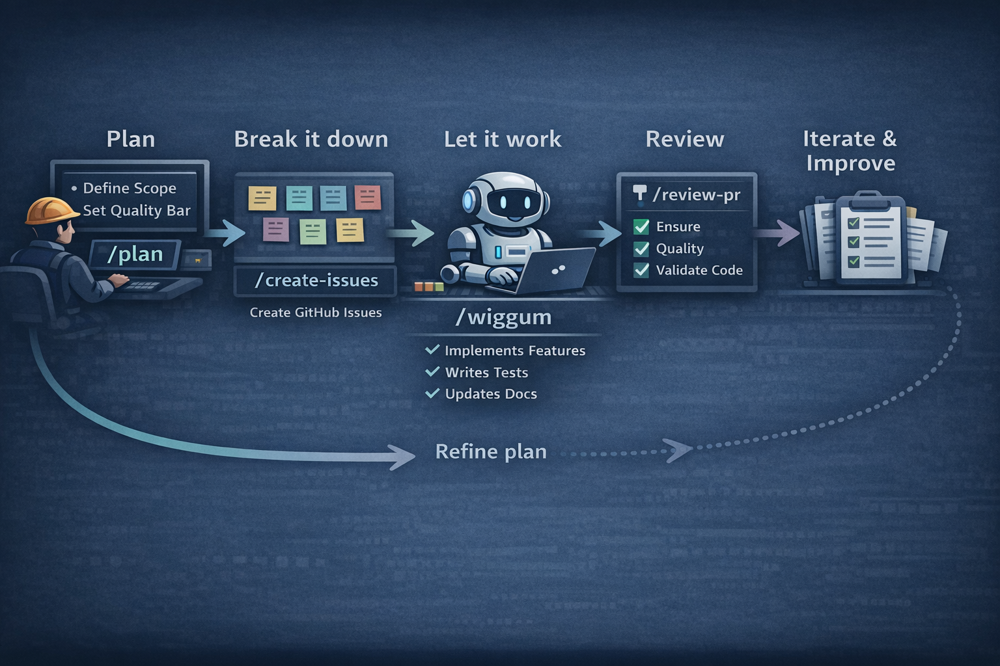

# Claude Bootstrapping

A portable configuration kit for [Claude Code](https://docs.anthropic.com/en/docs/claude-code). Deploy a battle-tested set of workflow commands, agents, and conventions into any project, then run a single command to adapt everything to the local tech stack.

## Why

Starting Claude Code in a new project means rebuilding the same scaffolding every time: issue workflows, PR conventions, TDD discipline, code review checklists. This repo packages all of that into a **golden set** — a baseline configuration that works out of the box and adapts to your project with one command.

## Quick Start

```bash
# 1. Clone this repo
git clone https://github.com/quadradad/claude-bootstrapping.git
cd claude-bootstrapping

# 2. Deploy the golden set into your project
./deploy.sh /path/to/your/project

# 3. Open Claude Code in the project and bootstrap
cd /path/to/your/project
claude
> /bootstrap-claude
```

`/bootstrap-claude` scans your project, detects the tech stack, and writes project-specific configuration (validation commands, architecture rules, scopes, permissions, and more) into CLAUDE.md.

## Architecture

v2.0 uses **progressive disclosure** to keep token costs low. Instead of loading everything into every session, content is organized into layers that are read only when needed:

| Layer | What | When loaded |
|-------|------|-------------|
| **CLAUDE.md baseline** | Behavioral instructions only (~55 lines) | Every session |
| **CLAUDE.md project-specific** | Tech stack, scopes, architecture rules | Every session |
| **agent_docs/** | Reference data (issue formats, CLI ops, lesson lifecycle) | On-demand by commands |
| **Command files** | Task-specific workflow steps | When invoked |

This replaced a single 175-line CLAUDE.md that loaded everything every time.

## What's in the Golden Set

```
golden/
├── CLAUDE.md                              # Baseline behavioral instructions
├── BUDGETS.md                             # Token budget constraints
├── CHANGELOG.md                           # Golden set evolution log
├── agent_docs/
│   ├── issue-conventions.md               # Issue title/body format spec
│   ├── issue-tracker-ops.md               # CLI operations reference table
│   └── self-improvement.md                # Lesson lifecycle & pruning rules
├── .mcp.json                              # MCP server config (context7)
└── .claude/
    ├── settings.local.json                # Pre-approved tool permissions
    ├── agents/
    │   └── code-reviewer.md               # Automated code review agent
    ├── skills/
    │   └── pomo/SKILL.md                  # Post-mortem / self-improvement
    └── commands/
        ├── wiggum.md                      # Autonomous dev loop
        ├── triage.md                      # Backlog analysis & dependency graphing
        ├── create-issues.md               # Plan-to-issues pipeline
        ├── close-issue.md                 # Issue validation & closure
        ├── setup-release.md               # Release planning & milestone setup
        ├── review-pr.md                   # Standardized PR review
        ├── bootstrap-claude.md            # Project adapter
        ├── improve-golden-set.md          # Extract improvements from projects
        ├── update-claude.md               # Push golden set updates into projects
        └── slim.md                        # Audit & compress the golden set
```

### CLAUDE.md

The central configuration file, kept deliberately small. Contains behavioral instructions only:

- **Development philosophy** — TDD, issue-driven workflow, plan-before-building, autonomous bug fixing
- **Subagent strategy** — guidelines for keeping the main context clean
- **Session start ritual** — review lessons, assess state, decide next action
- **Continuous improvement** — pointer to the full lesson lifecycle in `agent_docs/`
- **Issue tracker config** — tool, format, and pointers to reference docs
- **Commit & PR conventions** — conventional commits, smart close syntax, branch naming

Reference data that used to live in CLAUDE.md — the full issue format spec, CLI operations table, and lesson format — now lives in `agent_docs/` and is loaded only when commands need it.

Below a bootstrap marker, `/bootstrap-claude` appends project-specific configuration: tech stack, validation commands, architecture rules, scopes, and key files.

### agent_docs/ — The Reference Layer

Reference data that commands load on-demand instead of paying the token cost every session:

| File | Contents | Used by |
|------|----------|---------|
| `issue-conventions.md` | Issue title format, body template, dependency syntax | `/create-issues`, `/close-issue`, `/wiggum` |
| `issue-tracker-ops.md` | Full CLI operations table (15 commands for GitHub) | Any command that touches the tracker |
| `self-improvement.md` | Lesson format, lifecycle (Active → Validated → Promoted → Stale), pruning rules | `/pomo`, `/review-pr`, `/wiggum` |

The issue tracker ops file is swappable — replace the GitHub CLI commands with Jira, Linear, or GitLab equivalents and every command picks up the change automatically.

### Budget Governance

`BUDGETS.md` defines token budget constraints enforced by `/improve-golden-set`, `/bootstrap-claude`, `/update-claude`, and `/slim`:

| File | Budget |
|------|--------|
| CLAUDE.md baseline | 60 lines / 25 instructions |
| CLAUDE.md project-specific | 80 lines / 30 instructions |
| Each agent_docs/ file | 120 lines |
| .claude/lessons.md | 40 entries |
| settings.local.json allow list | 100 entries |

`CHANGELOG.md` tracks every golden set evolution cycle with structured entries, providing an audit trail for what changed and why.

### Workflow Commands

| Command | What it does |
|---------|-------------|
| `/wiggum` | Fully autonomous dev loop. Picks the next unblocked issue, branches, implements with TDD, validates, creates a PR, closes the issue, and repeats. Invokes `/pomo` when retries reveal debugging patterns. |
| `/triage` | Fetches all open issues, builds a dependency graph, detects cycles, classifies readiness, validates labels, and produces a prioritized backlog report. |
| `/create-issues` | Takes a plan from conversation and creates a structured set of issues — tracking epic, dependency links, acceptance criteria, and optional assignee resolution. |
| `/close-issue` | Quality gate for issue closure. Validates acceptance criteria, checks off criteria on the issue, posts a structured closing comment, and reports downstream unblocks. |
| `/setup-release` | Scopes a release by filtering issues, creates a milestone, sets up a release branch, generates a phased implementation plan, and creates a draft PR. |
| `/review-pr` | Seven-section PR review: metadata, architecture compliance, holistic update check, code quality, test coverage, security, and build gates. Captures lessons via `/pomo` when it finds issues. |
| `/improve-golden-set` | Scans a bootstrapped project for improvements. Classifies content (instruction vs. reference data), checks budget constraints, tests elevation level, and applies approved changes back into the golden set. |
| `/update-claude` | Pulls golden set updates into a bootstrapped project. Diffs `agent_docs/` and governance files alongside CLAUDE.md. Preserves all project-specific customizations. |
| `/slim` | Audits the golden set against budget constraints. Scans for redundancy, prunes stale lessons, verifies references, and compresses bloated files — all with explicit user approval. |

### Code Reviewer Agent

A subagent used by `/review-pr` and available independently. Checks architecture compliance, code quality, test coverage, security, and general hygiene against the rules in CLAUDE.md. Extensible via a bootstrap marker for project-specific checks.

### Self-Improvement System

The `/pomo` skill is the centralized entry point for all self-improvement. Commands don't do inline reflection — they route through `/pomo`, which:

- Captures lessons in `.claude/lessons.md` with a structured format
- Manages lesson lifecycle: Active → Validated (2+ incidents) → Promoted (encoded into commands) → Stale
- Prunes when lessons exceed 40 entries, archiving stale entries to `.claude/lessons-archive.md`
- References `agent_docs/self-improvement.md` for the full lifecycle spec

### Baseline Permissions

`settings.local.json` pre-approves common tool permissions so Claude doesn't prompt for every git, gh, npm, or python command. `/bootstrap-claude` adds project-specific permissions based on the detected stack.

## The Deploy Script

`deploy.sh` copies the golden set into a target project:

```bash
./deploy.sh /path/to/project
```

- Copies CLAUDE.md, `.claude/`, `.mcp.json`, `agent_docs/`, `BUDGETS.md`, and `CHANGELOG.md`
- Prompts before overwriting existing configuration
- Merges into existing directories without deleting project-specific files

It does **not** modify any configuration — that's what `/bootstrap-claude` is for.

## The Bootstrap Command

`/bootstrap-claude` is the bridge between the generic golden set and your specific project. It runs in four phases:

1. **Discovery** — Scans for package manifests, framework configs, build tools, CI/CD, documentation, project structure, issue tracker signals, and git state
2. **Confirm** — Presents findings and asks targeted questions: profile accuracy, git integration strategy, issue scopes, tracker selection, and task tracking mode
3. **Adapt** — Appends project-specific config to CLAUDE.md, classifies generated content (instructions → CLAUDE.md, reference data → `agent_docs/`), adds tool permissions, creates project-specific commands, augments the code reviewer, and runs a post-bootstrap budget check
4. **Summary** — Reports everything that was configured and suggests next steps

## Reference Workflow



These commands were built to support a specific development loop. Here's the workflow they were designed around — adapt it however you like.

### 1. Plan

For larger features, hand Claude a markdown file with requirements. For smaller work, just describe what you need and ask it to put together a plan. Either way, you end up with a conversation where the scope, approach, and sequencing are agreed on before any code is written.

### 2. Break it down

Once the plan looks right, run `/create-issues`. Claude converts the plan into a structured set of issues — a tracking epic, individual tasks with acceptance criteria, a dependency graph, labels, and a sequenced implementation order. Everything lands in your issue tracker ready to execute.

### 3. Let it work

Run `/wiggum` on the tracking issue and watch it go. It picks up tasks in dependency order, creates a feature branch, writes tests first, implements, runs validation, fixes what breaks — then opens a PR, merges it back into the working branch, and moves to the next task. When an issue requires multiple retry attempts, `/wiggum` automatically captures debugging patterns via `/pomo` before continuing.

### 4. Review

When the work is done, create a PR to your main branch and run `/review-pr`. It performs a structured seven-section review: architecture compliance, code quality, test coverage, security, and more. If the review finds issues, it captures lessons via `/pomo` to prevent recurrence.

### 5. Iterate

If the review surfaces issues, tell Claude to create issues for the findings, then run `/wiggum` on the new tracking issue. Same loop, same discipline — the review feedback gets the same structured treatment as the original feature work.

This cycle — plan, break down, execute, review, iterate — is the core loop. The commands handle the mechanical parts so you can focus on requirements and review.

## Keeping Projects in Sync

Once the golden set is deployed and bootstrapped, three commands handle ongoing sync:

### Pulling improvements back into the golden set

When you improve Claude configuration in a project — new commands, better instructions, refined conventions — extract those learnings back:

```bash
cd /path/to/claude-bootstrapping
claude
> /improve-golden-set ~/dev/my-project
```

Claude scans the project, diffs against the golden set, classifies each improvement (instruction vs. reference data), checks against budget constraints, tests for the minimum viable placement level, and applies approved changes to `golden/`. A changelog entry is appended automatically.

### Pushing golden set updates to projects

After the golden set evolves, propagate updates to bootstrapped projects:

```bash
cd /path/to/your/project
claude
> /update-claude ~/dev/shared/dotfiles
```

Claude diffs the golden set against what the project has — including `agent_docs/` and governance files — presents each change for approval, applies approved changes while preserving all project-specific customizations, and runs a post-application budget audit.

### Auditing and compressing

When the golden set drifts toward budget limits (or after every 5th `/improve-golden-set` cycle):

```bash
cd /path/to/claude-bootstrapping
claude
> /slim
```

Claude measures every budgeted file, scans for redundancy, prunes stale lessons, verifies cross-references, and presents findings for approval before making changes. A before/after measurement confirms the impact.

## Customization

The golden set is designed to be forked and modified:

- **Add commands** — Drop new `.md` files in `golden/.claude/commands/`
- **Add reference docs** — Create new files in `golden/agent_docs/` and reference them from CLAUDE.md
- **Adjust conventions** — Edit the baseline sections of `golden/CLAUDE.md` (stay within budget)
- **Change defaults** — Modify `golden/.claude/settings.local.json` for different baseline permissions

After deploying, project-specific customization goes below the bootstrap marker in CLAUDE.md — the golden set baseline stays above it.

## Requirements

- [Claude Code](https://docs.anthropic.com/en/docs/claude-code) CLI
- [GitHub CLI](https://cli.github.com/) (`gh`) — for the default issue tracker configuration
- Git

## License

MIT
